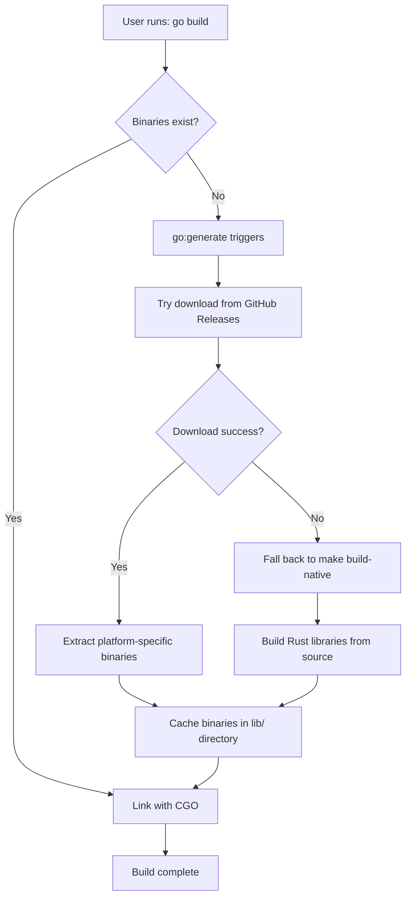

# LanceDB Go - Build System Documentation

This document explains the technical details of how the LanceDB Go build system works.

## Problem Statement

LanceDB Go uses native Rust libraries that need to be compiled for each platform. These compiled libraries are:

- **Large**: ~350MB per platform, 1.7GB total across all platforms
- **Platform-specific**: Different binaries for darwin_amd64, linux_arm64, etc.
- **Required for CGO**: Go's CGO needs to link against these libraries

**Traditional approaches don't work well:**

❌ **Commit binaries to Git**: Causes repository bloat, slow clones, Git push timeouts  
❌ **Require users to build**: Complex setup (Rust, cbindgen, platform dependencies)  
❌ **Dynamic linking**: Runtime dependencies, distribution complexity

## Our Solution: Download-on-Build

We use a hybrid approach that combines the benefits of both:

✅ **Clean Git repository**: Only source code, fast clones  
✅ **No build dependencies**: Users don't need Rust installed  
✅ **Automatic**: Works seamlessly with standard Go tools  
✅ **Efficient**: Downloads only what's needed for current platform  

## How It Works

### 1. Repository Structure

```
lancedb-go/
├── cmd/download-binaries/     # Binary download utility
│   └── main.go
├── internal/binaries/         # Download logic
│   └── download.go
├── pkg/lancedb/              # Main Go package
│   └── connect.go            # Uses //go:generate directive
├── .gitignore                # Ignores downloaded binaries
└── lib/                      # Auto-created, contains downloaded binaries
    ├── darwin_amd64/
    ├── darwin_arm64/
    ├── linux_amd64/
    ├── linux_arm64/
    └── windows_amd64/
```

### 2. Go Generate Integration

Each Go file that uses CGO includes a generate directive:

```go
package lancedb

//go:generate go run ../../cmd/download-binaries

/*
#cgo CFLAGS: -I${SRCDIR}/../../include
#cgo darwin,amd64 LDFLAGS: ${SRCDIR}/../../lib/darwin_amd64/liblancedb_go.a
// ... other platforms
*/
import "C"
```

### 3. Build Process Flow



### 4. Download Logic with Fallback

The download system (`internal/binaries/download.go`) includes intelligent fallback:

1. **Detects platform**: Uses `runtime.GOOS` and `runtime.GOARCH`
2. **Checks cache**: Looks for existing binaries in `lib/`
3. **Tries download**: Fetches from GitHub Releases
4. **On download failure**: Automatically runs `make build-native`
5. **Extracts/Builds**: Unpacks downloaded files OR builds from source
6. **Verifies**: Ensures required files are present
7. **Caches result**: Same caching for downloaded and built binaries

**Fallback triggers:**
- HTTP 404 (release doesn't exist yet)
- Network connectivity issues
- Malformed or corrupted downloads
- Missing platform-specific binaries in release

### 5. Release Process

When creating a release:

1. **CI builds** all platform binaries (~1.7GB total)
2. **Creates archive** `lancedb-go-native-binaries.tar.gz`
3. **Attaches to GitHub Release** (not committed to Git)
4. **Users download** only their platform (~350MB) on first build

## User Experience

### Standard Go Workflow

```bash
# Just works - no special setup needed
go get github.com/lancedb/lancedb-go
go build ./...  # Automatically downloads binaries on first build
```

### Alternative Workflows

```bash
# Explicit binary download
go generate github.com/lancedb/lancedb-go/...

# Using Makefile
make build      # Includes go generate

# Using build helper
go run build.go
```

### Environment Variables

- `LANCEDB_VERSION`: Specify release version (default: matches module version)
- `LANCEDB_RELEASE_URL`: Custom binary source URL

## Development Workflows

### For Library Users

**First-time setup:**
```bash
go get github.com/lancedb/lancedb-go
# On first build, ~350MB download for your platform
go build ./...
```

**Subsequent builds:**
```bash
go build ./...  # Fast - uses cached binaries
```

### For Contributors

**Local development with pre-built binaries:**
```bash
git clone https://github.com/lancedb/lancedb-go
cd lancedb-go
make build      # Downloads binaries, builds Go code
```

**Local development building from source:**
```bash
git clone https://github.com/lancedb/lancedb-go
cd lancedb-go
make build-native     # Compiles Rust libraries locally
make test
```

## Benefits

### For Users
- **No build dependencies**: No Rust, cbindgen, or platform toolchains needed
- **Fast setup**: `go get` + first build downloads everything needed
- **Standard Go workflow**: Works with any Go tooling
- **Efficient**: Downloads only current platform binaries

### For Repository
- **Clean history**: No binary commits, readable git log
- **Fast clones**: Repository stays small
- **No timeout issues**: GitHub Releases handle large files properly
- **Scalable**: Works regardless of binary size

### For Maintainers
- **Reliable releases**: No Git push timeouts
- **Clear separation**: Source code vs. binary distribution
- **Flexible distribution**: Can use mirrors, CDNs, etc.

## Comparison with Alternatives

| Approach | Repository Size | Clone Speed | Setup Complexity | Build Speed |
|----------|----------------|-------------|------------------|-------------|
| **Commit binaries** | 🔴 Very Large | 🔴 Very Slow | 🟢 Simple | 🟢 Fast |
| **Build from source** | 🟢 Small | 🟢 Fast | 🔴 Complex | 🔴 Very Slow |
| **Download-on-build** | 🟢 Small | 🟢 Fast | 🟢 Simple | 🟢 Fast |

## Technical Details

### Error Handling

The download system includes robust error handling:

- Network timeouts and retries
- Corrupted download detection
- Platform compatibility checks
- Clear error messages with troubleshooting steps

### Security

- Downloads only from official GitHub Releases
- SHA256 verification of downloaded archives
- Path traversal protection during extraction
- No arbitrary code execution

### Performance

- **First build**: One-time ~350MB download per platform
- **Subsequent builds**: No network access needed
- **Parallel downloads**: Multiple files downloaded concurrently
- **Resume support**: Handles interrupted downloads

This system provides the optimal balance of usability, performance, and maintainability for distributing Go libraries with native dependencies.
